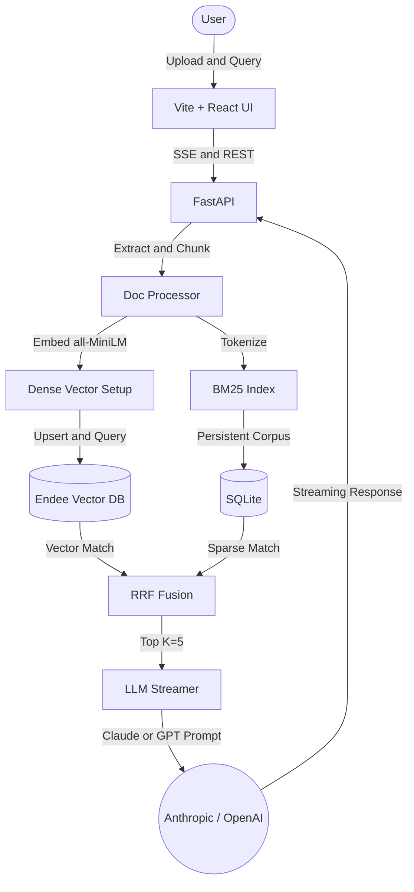

# DocuMind — AI Document Intelligence Platform

DocuMind is an end-to-end RAG (Retrieval-Augmented Generation) document intelligence platform. It allows users to upload PDF, TXT, and DOCX documents and query them naturally, receiving grounded, explicitly cited generated answers streamed word-for-word in real-time.

## Architecture



## Infrastructure Decisions
- **Endee Vector DB**: To ensure rapid 1-click startup out-of-the-box, the Endee Vector Database is consumed via its official docker image `endeeio/endee-server:latest` deployed in the `docker-compose.yml`. A custom python integration layer wrapper `backend/endee_client.py` uses the official Endee client package to effectively wire filtering, payload retrieval, and indexing.
- **BM25 Persistence**: Sparse indexing is persisted dynamically in `SQLite` and re-hydrated dynamically in code, avoiding massive indexing recalculations on queries! 
- **Embeddings**: By default, `all-MiniLM-L6-v2` executes strictly locally. Fallback or alternate openai usage can be flagged in `.env`.

## How Endee is Used

Endee powers DocuMind's dense similarity retrieval layer. Rather than simply acting as a "dumb" vector store, it plays heavily into RAG relevance filtering logic:
- **Collection Schema**: Uses a 384-dimensional `cosine` space mapping with precision `FP32`.
- **Payload & Metadata**: Vectors map to DocID alongside `meta` fields carrying paragraph text (`text`) and originating page (`page_num`). 
- **Filtering Capabilities**: During semantic search, operations are implicitly bound to matching document scopes by dynamically pushing `doc_id: {$eq: "x"}` into the query JSON, limiting hallucinated cross-pollination. 

## Quick Start (3 Commands)

1. Clone the repository and configure models:
   ```bash
   cp .env.example .env
   # Edit .env and supply ANTHROPIC_API_KEY
   ```

2. Start the full application stack (Vector Database + Backend + Frontend):
   ```bash
   docker compose up --build -d
   ```

3. Open the UI:
   Navigate to **[http://localhost:3000](http://localhost:3000)**


## Testing the API 

Test the streaming SSE directly with cURL:

```bash
# First, upload a document or index an abstract:
# To bypass, just ensure something is uploaded via UI.
# Query via cURL using Server-Sent Events (SSE) Header:

curl -H "Accept: text/event-stream" \
     -H "Content-Type: application/json" \
     -d '{"query":"What are the main topics?", "doc_id": null}' \
     http://localhost:8000/api/query
```

*Example Output expected on Terminal:*
```
data: {"text": "The"}
data: {"text": " main"}
data: {"text": " topics"}
data: {"text": " refer"}
...
data: [DONE]
```

## API Documentation
Interactive OpenAPI docs available at `http://localhost:8000/docs` while the server is running.

## Endee Repository
This project uses Endee as the vector database.
- ⭐ Starred: [endee-io/endee](https://github.com/endee-io/endee)
- 🍴 Forked: [your-username/endee](https://github.com/your-username/endee)